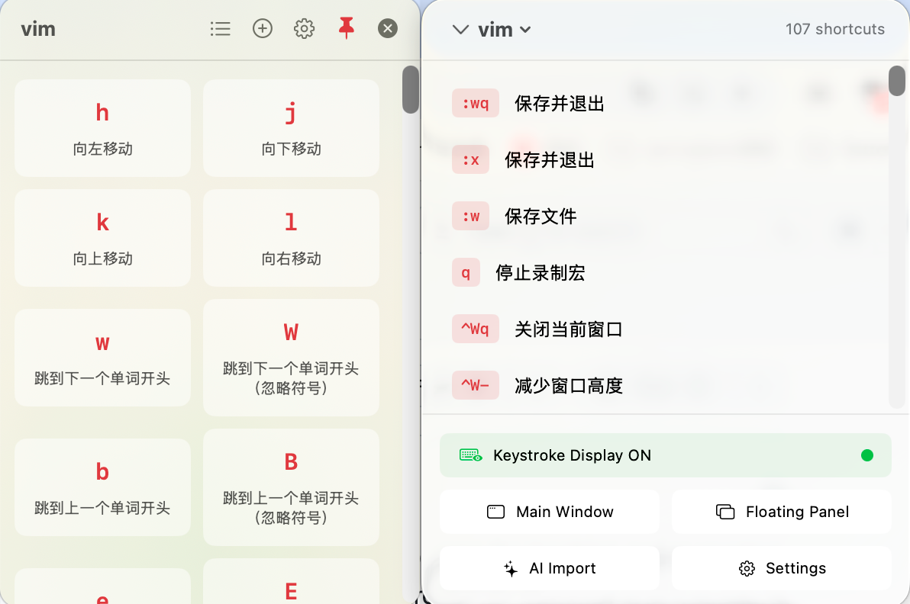
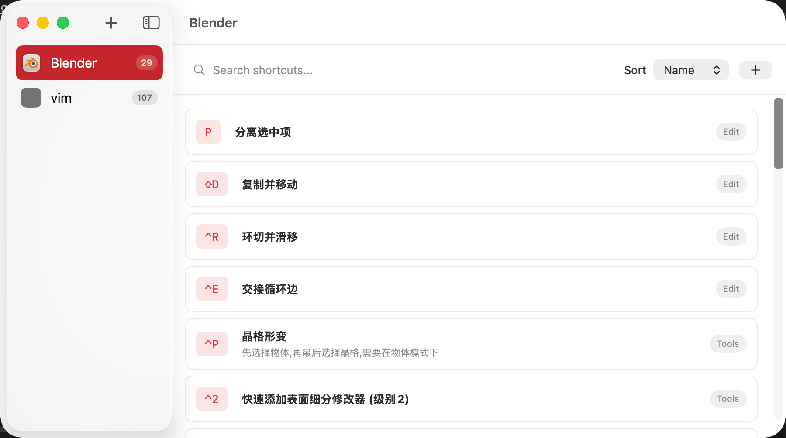
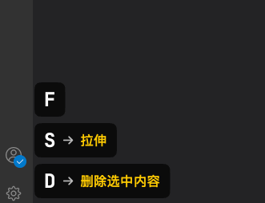

# ShortcutTracker ⌨️

一款 macOS 应用，帮助你管理和记忆各种应用程序的键盘快捷键。


## ✨ 功能特性

### 📱 应用管理
- 创建和管理多个应用程序的快捷键集合
- 自定义应用图标（支持 SF Symbols 和 Emoji）
- 按应用分类组织快捷键

### ⌨️ 快捷键管理
- 添加、编辑、删除快捷键
- 支持快捷键分类（如：文件、编辑、视图等）
- 快捷键描述和备注
- 可视化按键组合显示

### 🤖 AI 智能导入
- 支持从文本中自动提取快捷键 
- 集成 Google Gemini AI
- 支持 OpenAI 兼容 API
- 预览并确认导入的快捷键

### 🪟 浮动面板
- 悬浮窗口快速查看当前应用快捷键
- 支持窗口置顶
- 可调节透明度
- 支持拖拽移动和调整大小

### 📊 菜单栏
- 菜单栏快速访问
- 快速切换应用
- 一键打开浮动面板

### 💾 数据持久化
- 使用 SwiftData 本地存储
- 数据自动保存
- 支持导出快捷键

## 📸 截图







## 🛠 系统要求

- macOS 14.0 (Sonoma) 或更高版本
- Xcode 15.0 或更高版本（用于编译）

## 🚀 安装

### 从源码编译

1. 克隆仓库
```bash
git clone https://github.com/mdddj/ShortcutTracker.git
cd ShortcutTracker
```

2. 使用 Xcode 打开项目
```bash
open ShortcutTracker.xcodeproj
```

3. 选择目标设备为 "My Mac"，点击运行 (⌘R)

## 📖 使用指南

### 添加应用

1. 点击侧边栏底部的 "+" 按钮
2. 输入应用名称
3. 选择一个图标（可选）
4. 点击确认

### 添加快捷键

1. 在侧边栏选择一个应用
2. 点击快捷键列表上方的 "+" 按钮
3. 填写快捷键信息：
   - 名称：快捷键的功能名称
   - 按键：点击输入框后按下快捷键组合
   - 分类：可选，用于分组显示
   - 描述：可选，详细说明
4. 点击保存

### AI 智能导入

1. 点击菜单栏或工具栏的 "AI Import" 按钮
2. 粘贴包含快捷键的文本（如官方文档、教程等）
3. 点击 "Extract" 提取快捷键
4. 预览提取结果，可删除不需要的项
5. 选择目标应用
6. 点击 "Import" 确认导入

### 配置 AI 服务

在设置中配置 AI 服务：

**Gemini AI（默认）**
1. 前往 [Google AI Studio](https://makersuite.google.com/app/apikey) 获取 API Key
2. 在设置中选择 "Gemini" 并填入 API Key

**OpenAI 兼容 API**
1. 在设置中选择 "OpenAI Compatible"
2. 填入 API Endpoint 和 API Key
3. 指定模型名称（如 gpt-4, gpt-3.5-turbo）

### 浮动面板

- 使用菜单栏图标打开浮动面板
- 拖拽窗口背景移动位置
- 使用窗口控制按钮：
  - 📌 置顶/取消置顶
  - 🔍 调节透明度
  - ✕ 关闭面板

## 🏗 项目结构

```
ShortcutTracker/
├── Models/                 # 数据模型
│   ├── AppItem.swift       # 应用模型
│   └── ShortcutItem.swift  # 快捷键模型
├── Views/                  # 视图层
│   ├── AIImport/           # AI 导入视图
│   ├── Components/         # 可复用组件
│   ├── FloatingPanel/      # 浮动面板
│   ├── KeystrokeOverlay/   # 按键显示
│   ├── Menubar/            # 菜单栏
│   ├── Settings/           # 设置页面
│   ├── ShortcutList/       # 快捷键列表
│   └── Sidebar/            # 侧边栏
├── ViewModels/             # 视图模型
├── Services/               # 服务层
│   ├── AI/                 # AI 服务
│   ├── DataService.swift   # 数据服务
│   └── ShortcutExporter.swift
└── Utils/                  # 工具类
```

## 🔧 技术栈

- **SwiftUI** - 声明式 UI 框架
- **SwiftData** - 数据持久化
- **Combine** - 响应式编程
- **AppKit** - 原生 macOS 功能（浮动窗口、菜单栏等）

## 📄 License

MIT License

## 🤝 贡献

欢迎提交 Issue 和 Pull Request！

## 📮 联系

如有问题或建议，请通过 [GitHub Issues](https://github.com/mdddj/ShortcutTracker/issues) 联系。
